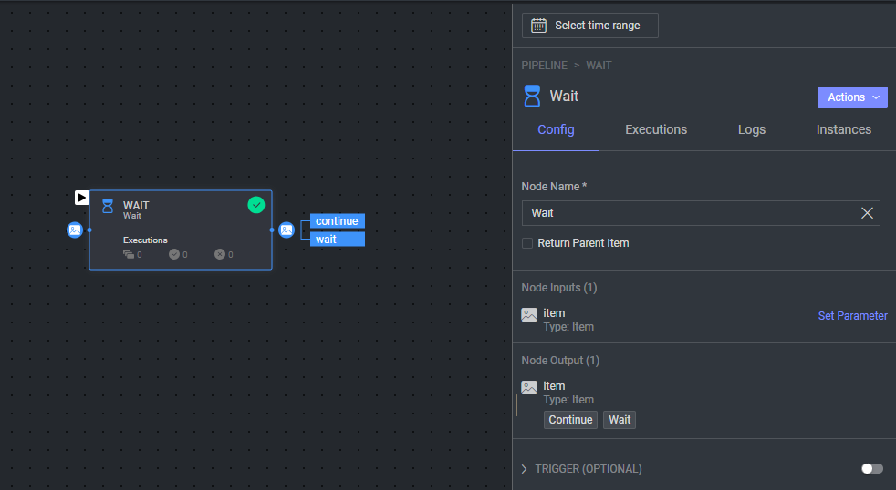

# Wait Node

### Description

The `wait` custom node is a helpful tool that can be added to any location in the pipeline. It will wait for all
previous executions to finish before continuing.

### Example Use cases:

* [Image Tiling](https://github.com/dataloop-ai-apps/image-tiling-nodes) - In this example, the `wait` node is used to
  ensure that all the work that needs to be done on the tiles is finished before the rest of the flow is activated.

* Working with Batches: The `wait` node can be used to ensure that all the items in a batch are processed before moving
  on to the next step.

### How to use:
* Add the `wait` node to the pipeline flow.
* connect the `continue` port to the next node in the pipeline.
* The `wait` port doesn't need to be connected to anything.

### Configurations:

* `Return Parent Item`: If checked, the node will return the parent item. If unchecked, the node will return the child
  items.
  Parent item is the item that triggered the pipeline cycle and got split to child items, it is identified as the item
  id in the child item's metadata `item.metadata.parentItemId`.

## Contributions, Bugs and Issues - How to Contribute

We welcome anyone to help us improve this app.  
[Here's](CONTRIBUTING.md) a detailed instructions to help you open a bug or ask for a feature request.
